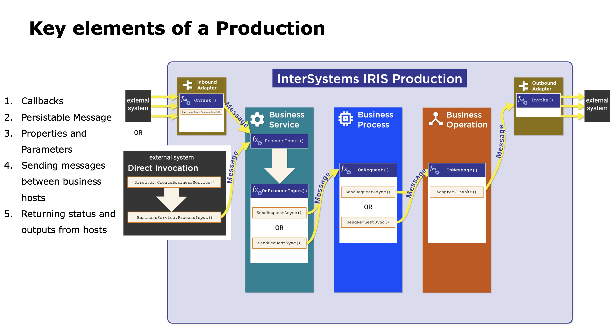
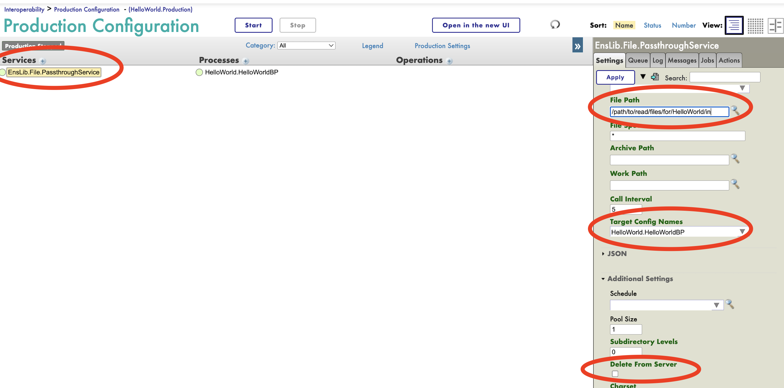
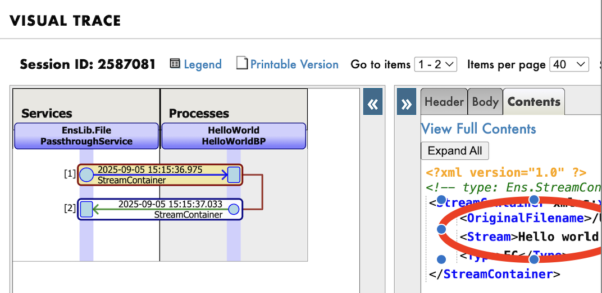

# InterSystems_PyProd

intersystems_pyprod is a library that allows you to create different components for the InterSystems Productions Framework, purely in python.


<div align="center"></div>


## Example
The following is a Business Process written using intersystems_pyprod. It just returns the request it receives back to the sender.

First follow [steps to setup environment variables](./docs/installing.md) to connect to a running iris instance.

```python
# save this as HelloWorld.py
from intersystems_pyprod import (BusinessProcess,Status)

class HelloWorldBP(BusinessProcess):
    def OnRequest(self, request):
        return Status.OK(), request

```

The following assumes you have set the environment variables.

```bash
$ intersystems_pyprod /full/path/to/HelloWorld.py

    Loading HelloWorldBP to IRIS...
    ...
    ...
    Load finished successfully.
```


Create a production using the UI

<div align="center"></div>

This production reads in a file from a defined path and then forwards it to a target business process. We use a pre-existing Business Service called Enslib.File.PassthroughService. We set a path from where it reads in the file. Then we select the Business Process that we created as its target. Note, the Business Process has the name of the script (HelloWorld) appended to it. Read more about package names [here](./docs/quickstart.md#step-2-package-name). 

Start the Production add then add a text file at the file path defined for the business service. Upon refreshing the production page, we can see the messages that were deliverd. 

<div align="center"></div>


NOTE: EnsLib.File.PassthroughService is an existing Business Service bundled with IRIS Productions. It loads a file from a given location and passes it forward to the desired target.


## Reporting Issues

Please report issues via GitHub Issues.

## Contributing

Contributions are welcome. Please submit changes via Pull Requests. 

## Useful links

[Installing](./docs/installing.md)

[Quick Start](./docs/quickstart.md)

[Debugging](./docs/debugging.md)

[API Reference](./docs/apireference.md)