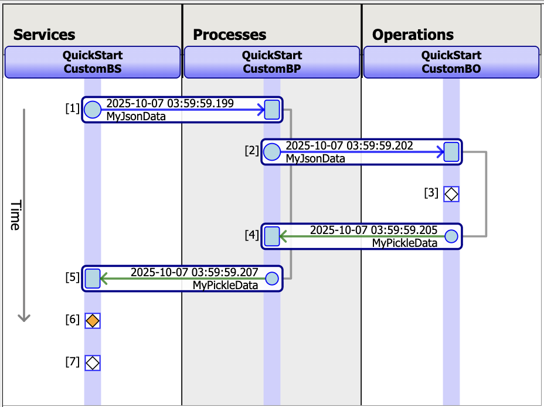

# Quick Start Guide

In the following example, we design a production which sends a Sync request from a Service to Process, which in turn sends a Sync request to an Operation:



## Step 1: Importing libraries and objects

First, import all the components that you might need from intersystems_pyprod. Also, import any other python library that you might be using.

```python
import time
import random
from intersystems_pyprod import (
    IRISParameter,
    IRISProperty,
    InboundAdapter,
    BusinessService,
    BusinessProcess,
    BusinessOperation,
    OutboundAdapter,
    Column,
    JsonSerialize,
    PickleSerialize,
    IRISLog,
    Status,
    debug_host,
)
```

## Step 2: Package name

In **InterSystems IRIS**, objects are organized into `packages`. **`iris_package_name`** is a pyprod-defined configuration variable and can be used to specify the name of the package to which all components defined within a module belong. In this example, **`iris_package_name`** is set at the module level, but it can also be defined at the class level if needed. All production components created in the script will appear in the **Production UI** using the format **`iris_package_name.class_name`**. You can read more about package names [here](./apireference.md#-package-name-project-organization-).


```python
iris_package_name = "QuickStart"
```


## Step 3: Create the message objects

The primary function of any production is to **pass messages**. Naturally, the design of a production depends on the types of messages it needs to handle.  

In this example, we define two message types:  

- **`MyJsonData`** and **`MyPickleData`** – these classes inherit from **`JsonSerialize`** and **`PickleSerialize`**, respectively. These superclasses specify the serialization method used for persisting the data contained in the message type. More information on how to create and initialize persistable messages can be found [here](./apireference.md#-persistable-messages-).  

**Note:**  **`Column()`** object used for certain fields in `JsonSerialize` and `PickleSerialize` subclasses indicates that those fields are stored in separate columns within the IRIS database. This design enables users to run SQL queries on those fields and even create indexes for faster lookups.
Read more about Columns [here](./apireference.md#-column-).

```python

class MyJsonData(JsonSerialize):
    name: str = Column(index=True)
    amount = Column(datatype = int)

class MyPickleData(PickleSerialize):
    name = Column()
    amount = 1

```


## Step 4: Creating an Inbound Adapter

An inbound adapter is responsible for receiving and validating requests from external systems. The adapter passes the data it receives to a Business Service. This data transfer can take the form of a regular Python object, an InterSystems IRIS object, or a Python message object (e.g., JsonSerialize or PickleSerialize).

In this example, we pass a Python list to the business service. For more details about the inbound adapter, read [here](./apireference.md#-inbound-adapter-). 

All inbound adapters will use the **`business_host_process_input`** method to pass data to the service. This method just accepts one input and returns a status output.

```python
class CustomInAdapter(InboundAdapter):

    def __init__(self,iris_host_object):
        super().__init__(iris_host_object)
        self.counter = 0
        # you must preserve the constructor signature defined by the base class 
        # if you want to define instance variables using __init__. 
        # DO NOT introduce additional parameters.
        # Alternatively, you can use IRISProperty to define instance variables of string and numeric types

    def OnTask(self):
        status = Status.OK()
        try:
            time.sleep(0.5)
            msg = ["any data type" , "can be shared", "between an adapter and service", self.counter]
            status = self.business_host_process_input(msg)
            self.counter += 1
        except Exception as e:
            status, _ = log_error_and_return_status("ERROR in CustomInAdapter OnTask : "+str(e))
        return status

```


## Step 5: Creating a Business Service

The role of a **Business Service (BS)** is to ensure that the data received from the adapter (or by direct invocation of the service) is packaged as a persistable message before it is passed to another [business host](./apireference.md#-production-overview-) using a **`SendRequest...`** method. 

In this example, the Business Service receives data from the adapter as a Python object. This is typical when the inbound adapter is also Python-based (though Python and ObjectScript adapters/services can be mixed).  

Here, we also see the use of **`IRISProperty`** and **`IRISParameter`**, which allow us to manage state directly within IRIS and link the class to the UI. **`IRISParameter`** acts as a class constant, while **`IRISProperty`** serve the purpose of an class variable. By configuring the **`settings`** field of an **`IRISProperty`**, we can specify that its value should be provided through the UI, making it behave like an instance variable as multiple instances of the same class can be created in the productio and each instance's IRISProperty values can be different, without affecting the class definition.

Read more about IRISProperty [here](./apireference.md#-irisproperty-)  
Read more about Business Service [here](./apireference.md#-business-service-)

```python
class CustomBS(BusinessService):

    prop_setting_0 = IRISProperty(default = "does not appear on the UI as settings have not been defined")
    prop_setting_1  = IRISProperty(default = 45, description = "this appears under Additional Settings", settings="")
    prop_setting_2  = IRISProperty(settings="MyCategory")
    prop_setting_3 = IRISProperty(description = "this appears when you click on the property name in the UI", 
                                  settings="MyCategory:bplSelector")
    prop_setting_4: int = IRISProperty(settings=":dtlSelector")

    target_config_name = IRISProperty(description="Drop down list of possible target hosts under category called Target", 
                                      settings="Target:selector?context={Ens.ContextSearch/ProductionItems?targets=1&productionName=@productionId}")
    ADAPTER: str = IRISParameter(value="QuickStart.CustomInAdapter", description="Full name of ADAPTER as would appear in the backend")

    def OnProcessInput(self, input):
        status = Status.OK()
        try:
            persistent_msg = MyJsonData(input[0], input[3])
            status = self.SendRequestSync(self.target_config_name, persistent_msg)
            IRISLog.Info("Type of prop_setting_1 is " + str(type(self.prop_setting_1)))
            IRISLog.Error("displaying how to generate an error message")
            IRISLog.Status(status)
            self.prop_setting_1 += 1
            IRISLog.Warning("prop_setting_1 has been incremented" + str(self.prop_setting_1))
        except Exception as e:
            status, _ = log_error_and_return_status("ERROR in CustomBS OnProcessInput : "+str(e))
        return status

    
```


## Step 6: Creating a Business Process

The **Business Process (BP)** is where the core logic of the production resides. It typically receives messages from services, transforms them or creates new messages, and then sends these to operations. A BP can also send messages to other BPs or even services. 

In this example, we demonstrate the **`OnRequest()`** method. Once it receives an incoming request, it randomly creates a message of either JsonSerialize type or PickleSerialize type, populating it from the input. It then sends this synchronously to the selected target (which is the business operation in this case).


```python

class CustomBP(BusinessProcess):

    target_config_name = IRISProperty(
        settings="Target:selector?context={Ens.ContextSearch/ProductionItems?targets=1&productionName=@productionId}")

    def OnRequest(self, request):
        status = Status.OK()
        try:
            if random.getrandbits(1):
                sync_request = MyJsonData(request.name + " json data from BP", request.amount)
            else:
                sync_request = MyPickleData(request.name + " pickle data from BP", request.amount)
            status, response = self.SendRequestSync(self.target_config_name, sync_request)
        except Exception as e:
            status, response = log_error_and_return_status("ERROR in CustomBP on_request : "+str(e))
        return status, response


```

## Step 7: Creating a Business Operation

A **Business Operation (BO)** sends data, either using an outbound adapter, or directly, to the final external target. 
All the requests routed to a business operation are first assessed for their message type. Then, the method that corresponds to this message type is looked up in a ***message map*** that you define within the opearation class. Finally, this method is used to handle the request. 


```python

class CustomBO(BusinessOperation):

    ADAPTER = IRISParameter("QuickStart.CustomOutAdapter")
    MessageMap = {
        "QuickStart.MyPickleData": "bo_method_1",
        "QuickStart.MyJsonData": "bo_method_2"
    }

    def bo_method_1(self, request):
        status = Status.OK()
        try:
            status, out_adapter_response = self.ADAPTER.out_adapter_method_1(" first argument ", parameter2 = " second argument ", python_object = ("third", "argument"))
            IRISLog.Info("Data received at bo_method_1 is: " + out_adapter_response[0])
            response = MyJsonData(out_adapter_response[0], out_adapter_response[1])
        except Exception as e:
            status, response = log_error_and_return_status("ERROR in CustomBO bo_method_1 : "+str(e))
        return status, response

    def bo_method_2(self, request):
        status = Status.OK()
        try:
            status = self.ADAPTER.out_adapter_method_2(" first argument ")
            IRISLog.Info("Data received at bo_method_2 is: " + request.name)
            response = MyJsonData("response from bo_method_2", 0)
        except Exception as e:
            status, response = log_error_and_return_status("ERROR in CustomBO bo_method_2 : "+str(e))
        return status, response
    

```

## Step 8: Creating an OutBound Adapter

**Outbound Adapters** act as an interface to external systems. They send the final output to the external system in the format required by that system. The adapter, linked to the business operation using the ADAPTER parameter, is run by the same CPU process as the Business operation.

```python
class CustomOutAdapter(OutboundAdapter):

    counter = IRISProperty(0,int)

    def out_adapter_method_1(self, information="default", parameter2 = "parameter2", python_object = ""):
        status = Status.OK()
        try:
            IRISLog.Info("All out adapter log messages are displayed in the BO log viewer on the production config page")
            IRISLog.Info(f"Data received at out_adapter_method_1 is: {information} {parameter2}  {str(python_object)}")
            response = ("response from out_adapter_method_1", self.counter)
            self.counter += 1
        except Exception as e:
            status, response = log_error_and_return_status("ERROR in CustomOutAdapter out_adapter_method_1 : "+str(e))
        return status, response
    
    def out_adapter_method_2(self, information="default"):
        status = Status.OK()
        try:
            IRISLog.Info("Data received at out_adapter_method_2 is: " + information)
        except Exception as e:
            status, _ = log_error_and_return_status("ERROR in CustomOutAdapter out_adapter_method_2 : "+str(e))
        return status

```

## Helper method to log errors

```python
def log_error_and_return_status(error_message):
    IRISLog.Error(error_message)
    status = Status.ERROR(error_message)
    response = "error"
    return status, response
```


[You can see the complete script here](../tests/helpers/QuickStart.py)
